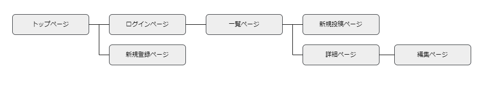

# アプリケーション名
AssistApp

# アプリケーション概要
社内タスク管理ツール。
発生した依頼タスクをアプリケーション内で管理することで、社内の業務効率化を図ることができる。

# URL
https://assistapp-39052.onrender.com

# テスト用アカウント

<li>Basic認証パスワード：2222</li>
<li>Basic認証ID：admin</li>
<li>メールアドレス：tarou@gomail.com</li>
<li>パスワード：aaa1234</li>
 

# 利用方法

# 依頼案件投稿

1.トップページのヘッダーからユーザー新規登録を行う 
2.依頼を投稿するボタンから、依頼案件の内容(担当エリア、依頼種別、納期、詳細、補足、参考画像)を入力し投稿する

# コメント投稿

1.担当する依頼案件に質問や確認したいことがあればコメントを送ることができる。 
2.コメントにも画像を1枚添付することが出来る。 
3.依頼を処理したユーザーが完了ステータスを「完了」に変更する。

# アプリケーションを作成した背景

前職で営業事務の仕事に従事していたが、多数の社内メンバーからの依頼が整理出来ず、依頼されたにも関わらず抜け漏れがあったり、納期が遅れるなどのトラブルが発生していた。
課題を分析した結果、使用していたタスク管理ツールがわかりずらく、社内の業務効率化に苦慮している企業も多いのではないかと推測し、業務効率化と生産性工場のために自己体験からわかりやすい社内タスク管理ツールを開発することにした。

# 洗い出した要件
<a href="https://docs.google.com/spreadsheets/d/1sDLOhJIBrC5x8M-7bC9iDSQRUqyzsSNG9yvpwNU_5-8/edit?usp=sharing">要件を定義したシート</a>

# 実装した機能についての画像やGIFおよびその説明
・ログイン画面

・ユーザー新規登録画面

・新規投稿画面

・編集画面

・コメント投稿

・画像拡大機能

・完了ステータスを変更

# 実装予定の機能

・検索機能
・エラーハンドリング
を実装予定。

# データベース設計

# 画面遷移図

# 開発環境

<li>Ruby</li>
<li>Ruby on rails</li>
<li>MySQL</li>
<li>PostgreSQL</li>
<li>Render</li>
<li>jquery</li>
<li>Lightbox2</li>

# ローカルでの動作方法
<li>% git clone https://github.com/mocchirihamu/assistapp.git</li>
<li>% cd assistapp</li>
<li>% bundle install</li>
<li>% yarn install</li>

# 工夫したポイント

<li>一覧画面を充実させる</li>
⇒事業所ごとに案件一覧を見れるようにした。 
⇒完了ステータス、コメント数を一覧画面に表示させ。 
⇒タスクの進行状況を一覧画面で把握しやすくした。

<li>プルダウンの活用</li>
⇒プルダウンや日時指定をカレンダー表示にすることで直感的に操作しやすい設計にした。
